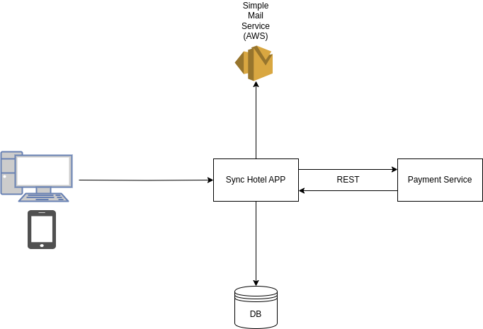
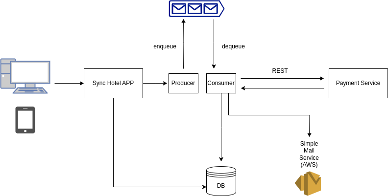

# Sistemas Web Backend: Uma Avaliação Comparativa entre Abordagens Síncronas e Assíncronas

Este projeto faz parte do Trabalho de Conclusão de Curso (TCC) do curso de Bacharelado em Ciência da Computação da Universidade Federal de Uberlândia (UFU). O objetivo deste trabalho é realizar uma avaliação comparativa entre abordagens síncronas e assíncronas no desenvolvimento de sistemas web backend. 

Caso tenha interesse na leitura do trabalho (ainda em desenvolvimento), o mesmo está disponível [aqui](./paper/TCC_v1.pdf).

Para isso, neste projeto serão/foram desenvolvidas duas aplicações web (sync-app/async-app) de exemplo utilizando as duas abordagens e, em seguida, serão/foram realizados testes de desempenho e escalabilidade.

Neste projeto utilizamos as seguintes tecnologias:

- **Linguagem**: Java 17
- **Banco de Dados**: Postgres
- **Testes de Desempenho**: Gatling
- **Gerenciamento de Containers**: Docker Compose
- **Filas de Mensagens**: Amazon SQS

## Estrutura do Projeto

O projeto está organizado da seguinte forma:

- **sync-app**: Aplicação web backend síncrona
- **async-app**: Aplicação web backend assíncrona
- **commons-domain**: Módulo de domínio compartilhado entre as aplicações

## Arquitetura das aplicações

- **Síncrona**
    - A aplicação síncrona é constituida de uma aplicação web backend que expõe uma API REST. Essa aplicação se comunica com o banco de dados relacional via driver JDBC. Além disso, faz requisições a um sistema de pagamento utilizando requisições HTTP, usando arquitetura REST.

- **Assíncrona**
    - A aplicação assíncrona também é constituida de uma aplicação web backend que expõe uma API REST. Entretanto, para as operações de comunicação e I/O, as requisições enfileiram mensagens em uma fila de mensagens. Essas mensagens são consumidas por um consumidor(thread) da aplicação que realiza a operação de I/O ou comunicação.
  

## Regra de negócio da aplicação

Essa aplicação consiste em um sistema online de reserva de acomodações em hotéis. Um sistema similar ao Booking.com, por exemplo.

Os requisitos da aplicação são: 

Para os clientes:
  1. Devem ser capazes de fazer pesquisas por um hotel em uma região. Também
   devem poder usar filtro com um range de preço, número de estrelas do hotel,
   piscina, etc.
  2. Devem ser capazes de fazer a reserva no hotel.
  3. Assim que fizerem a reserva, devem ser capazes de ver sua reserva.
  4. O cliente deve receber uma confirmação/notificação da sua reserva no
   número de celular ou email.

Para o manager:
  1. Devem ser capazes de se cadastrarem na plataforma, adicionando as
  informações do hotel.
  2. Devem poder atualizar as informações do hotel, por exemplo, eles poderão
  adicionar novos quartos, mudar o preço, adicionar novas imagens, etc.
  3. E também devem ver como estão as reservas, os lucros por quarto, etc.

## Estrutura banco de dados

Diagrama uml representanto as entidades do banco de dados bem como seus relacionamentos.

## Rodando a aplicação

Para rodar a aplicação, é necessário ter o Docker e o Docker Compose instalados na máquina.

**sync-app**
1. `docker-compose up -d sync-app`
2. `./aws/create-stack.sh`

**async-app**
1. `docker-compose up -d async-app`
2. `./aws/create-stack.sh`

